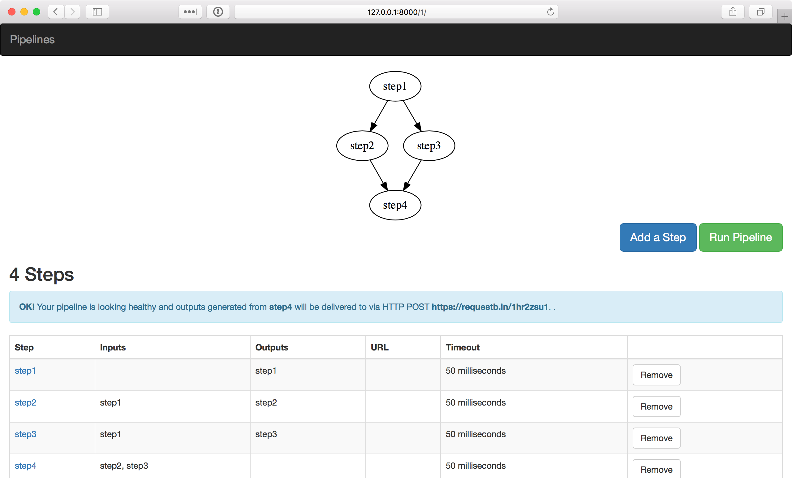

WA Pipelines
============

A Django app to setup pipelines that allow
collecting data from various endpoints in
a parallel fashion and submitting them to
a destination endpoint

::

    pip install wapipelines

::

    docker run \
        -e DATABSE_URL=db://foo/bar \
        -e SOCIAL_AUTH_GOOGLE_OAUTH2_KEY=<key> \
        -e SOCIAL_AUTH_GOOGLE_OAUTH2_SECRET=<secret> \
        -e SOCIAL_AUTH_GOOGLE_OAUTH2_WHITELISTED_DOMAINS=<domain1,domain2> \
        -p 8000:8000 \
        praekeltfoundation/wa-pipelines

